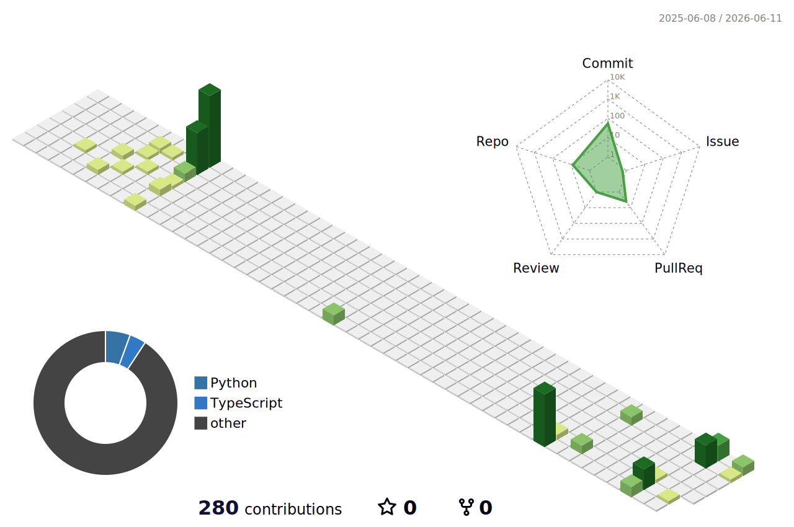

## 👋 Hi, I'm Bo 

🚀 Builder | iOS Developer | AI x Product Enthusiast  
🎯 Founder of **Croxet** — building apps that improve everyday life  

## 🧠 About Me
- 🎓 Computer Science
- 💡 Passionate about AI, full-stack, and product design  
- 🛠️ Building real-world apps, not just tutorials  
- 🌎 Based in Los Angeles

## 🧰 Tech Stack

**Languages**

**Frontend**
- React | Next.js | Tailwind  

**Backend**
- Node.js | PostgreSQL  

**Tools**
- AWS | Vercel | Git | Docker (learning)

## 📊 GitHub Stats

<!--START_SECTION:activity-->
<!--END_SECTION:activity-->

---

## 🚀 Current Projects

### 📱 MyTreasure
> Smart home inventory app to track, manage, and avoid overbuying  

### 🏋️ WinGym
> Fitness tracker with AI-powered performance insights  

### 📈 StockAnalyze
> AI-driven stock insights & market analysis  

---

---

## 🌱 Currently Learning
- AI-powered applications  
- Full-stack architecture  
- System design

- Building the Croxet product ecosystem  
- Shipping polished, real-world apps  
- Integrating AI into useful consumer products  
- Strengthening full-stack architecture skills   

---
## 📬 Connect With Me
- Portfolio: https://your-portfolio-link.com  
- LinkedIn: https://linkedin.com/in/your-link  
- Email: hello@croxet.com  

---
## Selected Projects

- **Croxet** — product brand and ecosystem  
- **MyTreasure** — home inventory system  
- **WinGym** — fitness tracking and insights  
- **StockAnalyze** — stock intelligence platform  
- **USC Events Pipeline** — scraping + PostgreSQL + ICS automation  
- **Home Manager Desktop** — PySide6 + PostgreSQL app  

---
## Philosophy

I build software with a focus on clarity, usefulness, and real-world impact.  
Clean design, practical features, and thoughtful engineering always come first.

